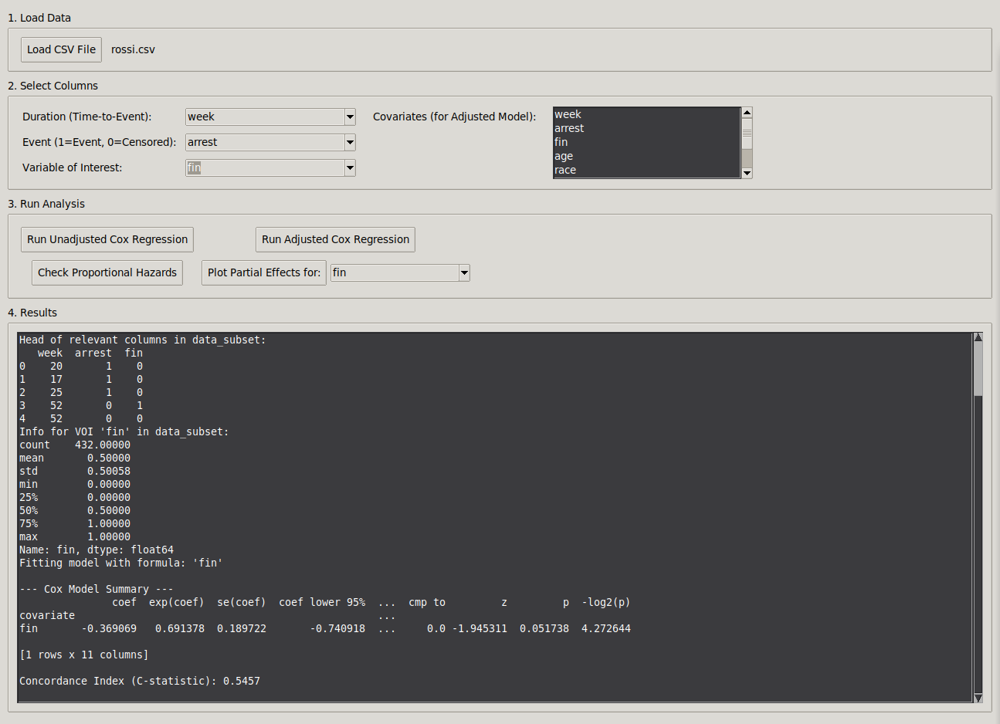

# 🚀 Cox Regression GUI Analyzer 📈

[](https://www.python.org/downloads/)
[](https://www.gnu.org/licenses/gpl-3.0)
[](https://github.com/msbCyricTohoku/CoxGUI/actions)
[](https://github.com/msbCyricTohoku/CoxGUI/issues)
[](https://github.com/msbCyricTohoku/CoxGUI/releases)

> A **super simple** Python desktop app for Cox proportional hazards regression — no command-line survival analysis headaches!

---

## ✨ Features

- **Load any CSV** and select your time, event, and covariates  
- **Unadjusted & Adjusted models** with one click  
- **Proportional Hazards check** (Schoenfeld residuals)  
- **Interactive plots** of hazard ratios & survival curves  
- ✅ Export results to text files and save plots as PNG

---

## 📸 Screenshot



---

## 🛠️ Installation

1. Clone or download this repo:
    ```bash
    git clone https://github.com/msbCyricTohoku/CoxGUI.git
    cd CoxGUI
    ```
2. Install dependencies:
    ```bash
    pip install pandas lifelines matplotlib
    ```

---

## ▶️ Usage

Simply run:
```bash
python cox_gui.py
```

Use the **File** menu to export analysis results or save the latest plot.
